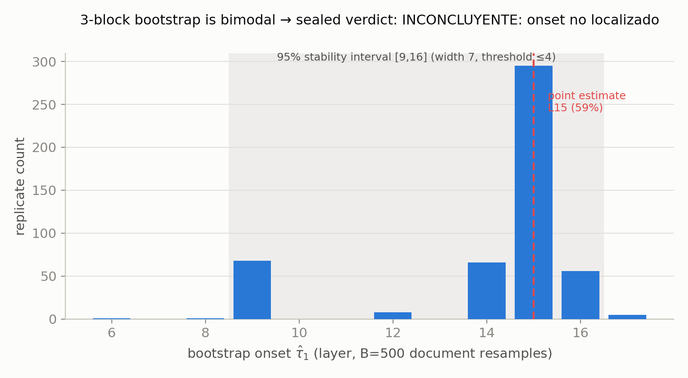
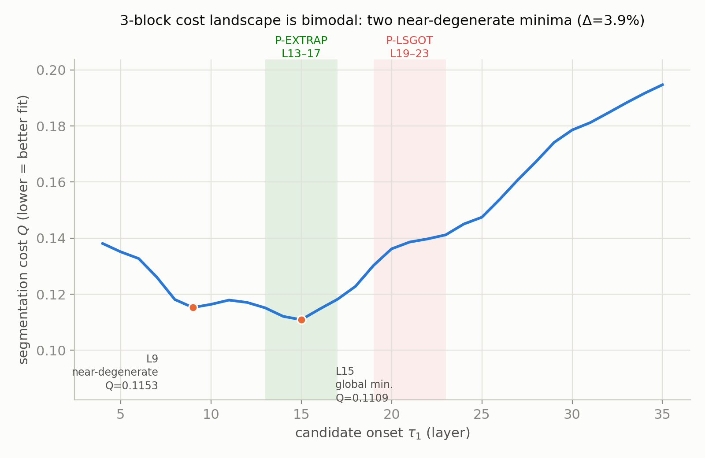
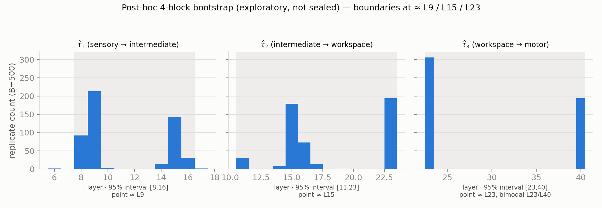
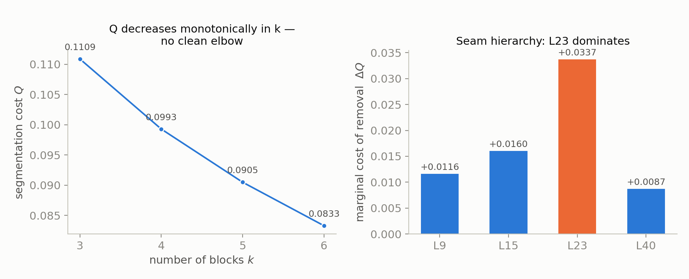
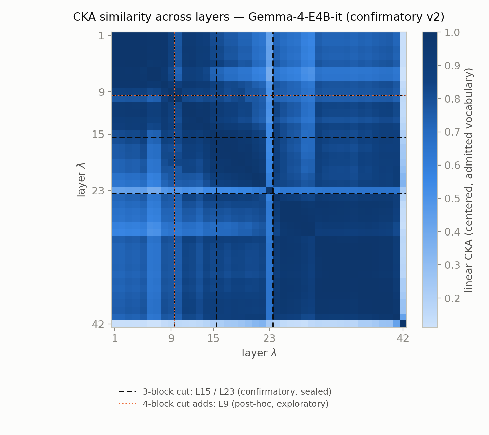
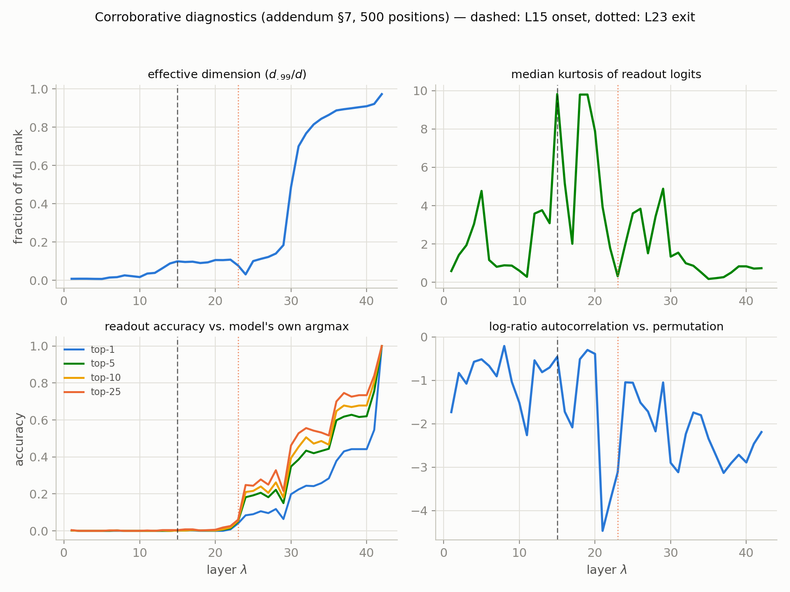

# Workspace layer anatomy is conserved — and refined — at 8B scale: onset at 35.7% depth and four CKA seams in Gemma-4-E4B-it

**Authors:** Jorge Castillo Sepúlveda, Marco Torres Yévenes, Juan Carlos Lanas
**Affiliations:** AXIS Dynamics SpA · https://axisdynamics.cl · contacto@axisdynamics.cl
**Status:** first-stage preprint (v2.1) — not peer-reviewed. Target venue: arXiv cs.LG / Axisdynamics preprint series.
**Evidence status:** complete confirmatory run (200/200 valid documents) under a sealed decision rule whose formal localization verdict is *inconclusive*; plus an explicitly exploratory post-hoc structural diagnosis that explains the non-localization and defines the follow-up pre-registration (§7).

---

## Abstract

Anthropic's *J-lens* study (Gurnee, Sofroniew, Lindsey et al., 2026) reports that verbalizable representations in Claude Sonnet 4.5 crystallize into a global workspace at ~37% relative depth, leaving open (§9.1) whether that depth fraction generalizes across scales and training regimes. We replicate the full J-lens estimator (*current-and-future* cotangent, pre-norm residual targets, centered linear CKA over the admitted vocabulary) on google/gemma-4-e4b-it (42 layers, 8B scale, mm-RLHF post-training) under a pre-registered protocol with a sealed bootstrap decision rule. Three results. (1) **The depth fraction is conserved:** the point estimate places the onset at L15 = 35.7%, within two points of Sonnet 4.5's ~37%, with the workspace→motor transition at L23. (2) **The sealed localization verdict is inconclusive:** the 95% stability interval is [L9, L16] (width 7 > threshold 4) and the bootstrap distribution is bimodal (59% at L15, 14% at L9). (3) **The non-localization has a structural explanation**, which we report as an exploratory diagnosis: the network does not have two boundaries but **four ranked CKA seams — L9, L15, L23, and L40 —**, and forcing a three-block segmentation makes the estimator alternate between competing anatomies, which is precisely what the bootstrap records. The seam hierarchy by marginal weight (ΔQ on removal: L23 +0.034 ≫ L15 +0.016 > L9 +0.012 > L40 +0.009) identifies the workspace *exit* (L23), not its entrance, as the network's dominant transition. The final segment L40–42 is not a coherent block (intra-block CKA 0.558 < cross 0.670) and is read as an emission seam, not a functional band. Since the segmentation cost Q decreases monotonically in the number of blocks with no clean elbow, no value of k is established here; the follow-up pre-registration (§7) replaces "how many blocks?" with the identifiable question — "which seams localize individually under bootstrap?" — with registered prediction {L9, L15, L23, L40}.

---

## 1. Introduction

Gurnee, Sofroniew, Lindsey et al. (Anthropic, *Verbalizable Representations Form a Global Workspace in Language Models*, Transformer Circuits Thread, July 2026) identify a band of layers in Claude Sonnet 4.5 where hidden-state content becomes broadly available for verbalization — a "global workspace" in the cognitive-science sense — with onset at ~37% relative depth. Their §9.1 leaves open the question this work addresses: is that depth fraction conserved at other scales and post-training regimes, or is it an artifact of Sonnet's architecture and recipe?

We answer with a direct replication at 8B scale — and, along the way, find something the original question did not anticipate: at this scale, the model's layer anatomy is richer than the sensory/workspace/motor partition the original methodology presupposes, and that richness is measurable from the very artifacts the replication produces.

One methodological note replicators should know: our first run (protocol v1.1) mistranscribed the estimator, computing only the position-to-position term ∂z[t]/∂h[t] instead of summing the cotangent over all valid future target positions t′≥t. A future-blind lens measures local next-token machinery, not global availability for later verbalization, and systematically underestimates onset depth (≈L10 instead of L15). Full detail lives in the pre-registration changelog (reference 4); the body of this paper uses only the corrected estimator, and §4 shows the v1.1↔v2 discrepancy also has a structural reading.

## 2. Method

**Model.** google/gemma-4-e4b-it, 42 transformer layers (λ = 1…42, no embedding row in the layer index), mm-RLHF post-training.

**Estimator.** *Current-and-future* J-lens (addendum eq. 1-2): the cotangent is injected at every valid target position in a document, not only the position under analysis, aggregated in two stages — across positions within a document, then across documents with equal weight. Pre-norm residual target (addendum eq. 3-4): z is the last block's output and the readout is `r_λ(h) = softcap(W_U · N(J̄_λ h) + b_U)`, with RMSNorm applied inside the readout.

**CKA and segmentation.** Centered linear CKA over the admitted vocabulary (255,893 of 262,144 tokens; hash published in §8) via the closed form `G = W_c^T W_c`. Contiguous-block segmentation minimizes `c(a,b) = 2/(m−1)·Σ_{i<j} D_ij` over CKA distances `D = 1 − CKA`, with `Q = Σ block costs / 42`, minimum block sizes 3 (5 for the workspace block in the sealed three-block cut), solved by exact enumeration with deterministic tie-breaking.

**Corpus.** WikiText-103, test split, seed 42, 256-token documents: 200 to fit J̄ + 100 held-out evaluation documents. 200/200 valid; ~144 s/document.

**Uncertainty.** Per-document bootstrap, B = 500, seed 42. The 95% stability interval is the shortest contiguous integer interval containing ≥95% of replicas (not a classical frequentist CI). The onset is declared **localized** only if that interval has width ≤4 layers; contrasted with an m-out-of-n bootstrap (m = 69).

**Pre-registered decision windows** (unchanged from the frozen text): **P-LSGOT** predicts onset in L19–23 (45–55% depth), derived from layer-resolved analyses in internal documents of the LSGOT series, referenced by hash in the pre-registration (references 2–4). Provenance note: the published LSGOT paper (arXiv:2607.09842) analyzes final-layer trajectories exclusively and does not contain the L21 prediction; that hypothesis lives only in the frozen internal material, with its layer-resolved analysis committed to that series' companion work; **P-EXTRAP** predicts onset in L13–17 (31–40%, extrapolating Sonnet's ~37%). Windows and localization threshold were fixed before computing any Jacobian on this model with the corrected estimator.

## 3. Confirmatory result

The point estimate is **τ̂₁ = L15** (15/42 = 35.7% relative depth), at the center of the P-EXTRAP window and within two percentage points of Sonnet 4.5's ~37%. The workspace→motor transition is **τ̂₂ = L23**. Cut quality: Q = 0.1109, R₃ = 0.480, G_min = 0.1379. The onset is identical under admitted and full vocabulary.

The sealed rule requires more than a point estimate inside a window: it requires the onset to be *localized*. It is not: the 95% stability interval is **[L9, L16]** (width 7 > threshold 4; m-out-of-n gives a consistent [L9, L17]), and the bootstrap distribution is **bimodal** — 59% of 500 replicas at L15 (84% within L14–17), with a 14% secondary mode at L9. The formal verdict, as pre-registered and without reframing:

> **Inconclusive: onset not localized.**

*Figure 1. Three-block onset bootstrap (B=500). 59% of replicas at L15, 14% secondary mode at L9; the [9,16] interval exceeds the localization threshold.*

On the competing hypotheses: P-LSGOT is refuted in its strong form — L21 is not the workspace *entrance* (we return to its reinterpretation in §4.4). P-EXTRAP receives the point estimate at the exact center of its predicted window but cannot be marked "confirmed" under the sealed rule. This verdict is reported here once; the rest of the paper analyzes what structure produces it.

## 4. Structural diagnosis (exploratory): four seams, not two boundaries

*Everything in this section is post-hoc and exploratory: it was not part of the sealed confirmatory analysis and motivates the follow-up pre-registration of §7, not a confirmed result. Every figure is reproducible from the artifacts in `data/` via `figures/seam_analysis.py`.*

### 4.1 Two nearly degenerate minima

The three-block cost landscape has two nearly degenerate minima: τ₁ = 15 (Q = 0.1109) and τ₁ = 9 (Q = 0.1153), separated by only 3.9%. A forced three-block segmentation chooses between two real candidate boundaries depending on which documents each resample draws — it does not converge on noise around a single one.

*Figure 2. Segmentation cost as a function of candidate onset. The point estimate (L15) falls inside P-EXTRAP; L21, the center of P-LSGOT, lies past both candidates.*

### 4.2 The bootstrap alternates between two complete anatomies

Relaxing the segmentation to four blocks places boundaries at **L9, L15, and L23** (Q = 0.0993). However — and this point corrects a reading we held in an earlier draft of this very paper — that segmentation's bootstrap is **not more stable** than the three-block one: the 95% intervals of τ₁, τ₂, τ₃ have widths 8, 12, and 17 respectively (`data/bootstrap_4blocks.json`). Moving from three to four blocks does not "resolve" the instability.

What the marginal distributions do show is an alternation pattern: τ₁ concentrates at L9 (43%) and L15 (29%); τ₂ at L23 (39%) and L15 (36%); τ₃ at L23 (61%) and L40 (39%). This is consistent with replicas oscillating between **two complete four-block anatomies**:

- Anatomy A: cuts at (L9, L15, L23)
- Anatomy B: cuts at (L15, L23, L40)

Only marginals are available in the published artifacts, so the alternation is inferred, not demonstrated; the follow-up pre-registration stores the joint distribution precisely to close this point (§7).

*Figure 3. Bootstrap stability of the three four-block boundaries. The τ₂ and τ₃ bimodalities are the signature of the alternating anatomies A/B.*

### 4.3 The five-block segmentation unifies both anatomies

The direct check: the optimal **five**-block segmentation (exact enumeration) places its four seams exactly at **L9, L15, L23, and L40** (Q = 0.0905) — the union of anatomies A and B. The two previously discrepant single-boundary estimates (≈L10 from the future-blind v1.1 estimator; L15 from the corrected one) and the two alternating bootstrap anatomies are all partial projections of this single structure.

Each seam's weight, measured as the increase in Q when it is removed from the five-block cut, establishes a clear hierarchy:

| Seam | ΔQ on removal | Reading |
|---|---|---|
| **L23** | **+0.0337** | workspace exit — the network's dominant transition |
| L15 | +0.0160 | workspace entrance (35.7% depth) |
| L9 | +0.0116 | end of the early sensory band |
| L40 | +0.0087 | start of the emission region |

*Figure 4. Left: Q decreases monotonically in k (0.1109 → 0.0993 → 0.0905 → 0.0833 for k=3…6) with no clean elbow — block count is not identifiable from cost. Right: seam hierarchy by marginal weight; L23 dominates.*

Two caveats the analysis itself imposes. First: since Q decreases monotonically in k by construction and the relative improvements show no elbow (10.5%, 8.9%, 8.0%), **no value of k is established by this analysis** — neither four nor five blocks. The identifiable question is not "how many blocks?" but "which seams localize individually?". Second: the final segment **L40–42 is not a coherent block** — its mean intra-block CKA is 0.558, *lower* than its cross similarity with the motor block (0.670). L40 marks where the final layers begin to diverge individually toward the unembedding: an **emission seam**, a readout phenomenon, not a fifth homogeneous functional band.

*Figure 5. Layer×layer CKA similarity. The four seams {L9, L15, L23, L40} are genuine similarity drops visible in the matrix, not artifacts of any single segmentation choice.*

### 4.4 Reinterpreting the LSGOT signal

L21 — the layer implicated in internal layer-resolved observations of the LSGOT series (see the provenance note in §2; not part of the published LSGOT paper) — sits two layers from L23, the heaviest seam in the entire network. The P-LSGOT hypothesis got the role wrong (entrance) but not the region: the earlier signal pointed at the neighborhood of the workspace *exit*, which this analysis identifies as the dominant transition. The corroborative diagnostics of §5 (local extrema of kurtosis and autocorrelation near L21) are consistent with that reading. Developing it further is the subject of the corresponding companion note, not this paper.

## 5. Robustness controls

- **Vocabulary:** identical onset (L15) under admitted (255,893 tokens) and full (262,144) vocabulary.
- **Precision:** onset invariant under fp16.
- **CKA validity:** the closed form matches an explicit computation on a 20K-token subset to 1e-5.
- **Causality:** the estimator's gradient with respect to non-causal target positions (t′ < t) is exactly 0.00e+00.
- **Corroborative diagnostics** (addendum §7, 500 positions): median kurtosis in [0.18, 9.82]; readout top-{1,5,10,25} accuracy against the model's own last-layer argmax = 1.000 at every k; effective dimensionality d.99/d in [0.007, 0.973]; mean log-ratio autocorrelation −1.713.

*Figure 6. Corroborative diagnostics per layer, with L15 and L23 marked. Effective dimension and top-k accuracy rise sharply near L23 — consistent with output-proximal readout fidelity —; kurtosis and autocorrelation show local extrema near L21, inside the workspace band.*

## 6. Discussion

Read strictly, the confirmatory result answers the source paper's open §9.1 question: at 8B scale and under a different post-training regime, the workspace onset falls at 35.7% depth — the fraction is not obviously an artifact of a single model family, though a single replication cannot establish it as a constant.

Read with the care the sealed rule imposes, this work's most informative contribution is not the numerical coincidence but the structural diagnosis: the three-block operationalization inherited from the original methodology is **architecturally misspecified** for this model. The network has at least four ranked CKA seams, and a procedure licensed to report only two oscillates between partial projections of that structure — which is exactly what the inconclusive verdict recorded. The non-localization was not a failed measurement; it was the pre-registration detecting a false structural assumption.

The hierarchy finding deserves emphasis: the network's dominant seam (L23, with ΔQ three times L40's and twice L15's) is not the workspace entrance but its exit. If this holds across architectures, it suggests the most marked computational event in these models' layer organization is the transition from global availability to motor/emission commitment — a hypothesis with a direct echo in the prior LSGOT signal (§4.4), testable with the ongoing panel.

We deliberately avoid dynamical-systems vocabulary ("attractor", "crystallization") when describing this anatomy: these are properties of a similarity matrix and a segmentation objective, not claims about the model's internal dynamics.

**Outlook.** A parallel run on Qwen2.5-7B-Instruct (28 layers, SFT-only) shows the opposite profile: a single sharp onset at L8 with a zero-width 95% interval (492/500 identical replicas). Whether seam *sharpness* — not just location — is diagnostic of the post-training regime is the subject of the companion paper, once DeepSeek-R1-Distill-7B completes the panel.

## 7. Experiments pending before the peer-review version

This preprint is the first stage of the series. Before submission for peer review, the following remain registered as pending:

1. **Sealed bootstrap of the five-block model** (B=500, new pre-registered seed), with a *per-seam* localization criterion (width ≤4 per boundary) instead of a per-block-count one. Registered prediction: all four seams {L9, L15, L23, L40} localize individually once the segmentation model admits them all.
2. **Joint bootstrap distribution** (τ₁, τ₂, τ₃, τ₄), not marginals only — required to demonstrate (rather than infer) the alternating anatomies A/B of §4.2.
3. **Pre-registered model-selection criterion** for k (boundary stability as primary criterion; penalized Q as secondary), frozen before computing on new data.
4. **Dedicated diagnosis of the L40–42 region** (intra vs cross CKA per replica) to support or discard the "emission seam" reading.
5. **Cross-architecture panel** (Qwen2.5-7B-Instruct closed; DeepSeek-R1-Distill-7B in progress) for the seam-sharpness ↔ post-training-regime hypothesis.
6. **Corpus replication** (a second corpus beyond WikiText-103) to rule out domain dependence in seam positions.

## 8. Limitations and reproducibility

- A single confirmed architecture (Gemma-4-E4B-it); depth-fraction conservation must not be generalized without the §7 panel.
- All of §4 is exploratory and post-hoc; none of the four seams is confirmed under a sealed rule until §7.1–7.3 complete.
- The A/B anatomy alternation (§4.2) is inferred from marginals; demonstrating it requires the joint distribution (§7.2).
- Full protocol, estimator addendum (eq. 1-26), and deviation changelog (SHA-256 hashes) ship as supplementary material; see `data/DATA_SOURCES.md` for the provenance of every figure. The raw Jacobian tensor (1.1 GB) is referenced by checksum.
- Corpus, seeds, vocabulary hash (`6bd2b7d9…0289e3`), and bootstrap parameters in §2; the analysis path is deterministic given those values. §4.3 figures regenerate via `figures/seam_analysis.py` from `data/cka_matrix_v2.npy`.

## 9. Conclusion

At 8B scale and under a different post-training regime, the workspace onset of Gemma-4-E4B-it falls at 35.7% relative depth, closely conserving the fraction Anthropic reported for Sonnet 4.5. The sealed localization verdict — inconclusive — is not a null result but the measurable symptom of a false structural assumption: the network does not have two boundaries but four ranked seams {L9, L15, L23, L40}, dominated by the workspace exit at L23. The well-posed question for the next stage is not how many blocks the model has, but which seams survive a pre-registered per-seam localization criterion — and that pre-registration is defined here.

---

## References

1. Gurnee, W.\*, Sofroniew, N.\*, Pearce, A., Piotrowski, M., Kauvar, I., Chen, R., Soligo, A., Bogdan, P., Ong, E., Wang, R., Thompson, T. B., Abrahams, D., Kantamneni, S., Ameisen, E., Batson, J., Lindsey, J.\*† (2026). *Verbalizable Representations Form a Global Workspace in Language Models*. Transformer Circuits Thread, Anthropic. https://transformer-circuits.pub/2026/workspace/index.html (July 6, 2026).
2. Internal pre-registration `preregistro_A1_jlens_L21.md` (v1.1, frozen; SHA-256 `af754c73c8b92b6a2eb4d3bd0b87c091579971adc698364de04278e5dfca813f`).
3. Internal addendum `propuesta_adenda_A1_MATH_v1.0.md` (SHA-256 `038204e637d3e160547700314e0e45a9a99624af8660b953f509ef195f1e9001`).
4. Internal changelog `preregistro_A1_CHANGELOG.md` — complete deviation log with dates and hashes.

**Data and code availability:** the derived artifacts (CKA matrix, bootstrap distributions, curves, confirmatory report, `seam_analysis.json`) accompany this preprint in `data/`; `figures/generate_figures.py` and `figures/seam_analysis.py` deterministically regenerate all figures and §4.3 numbers. See `data/DATA_SOURCES.md` for provenance and the checksum of the excluded raw Jacobian tensor.
